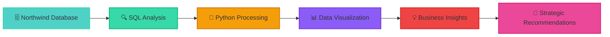

# 📊 Northwind Database Business Intelligence Analysis
<div align="center">


### 🎯 **Transforming the classic Northwind dataset into actionable business intelligence**

</div>

---

## 🌟 Executive Summary

<div align="center">

```
┌─────────────────────────────────────────────────────────────────┐
│  🎯 PROJECT IMPACT                                              │
├─────────────────────────────────────────────────────────────────┤
│  🔍 Operational Insights    │  📈 Strategic Recommendations      │
│     Performance gaps        │     Data-driven decisions          │
├─────────────────────────────────────────────────────────────────┤
│  📊 Customer Segmentation   │  💼 Business Intelligence          │
│     Targeted strategies     │     Mock-to-real transformation    │
└─────────────────────────────────────────────────────────────────┘
```

<table>
<tr>
<td align="center"></td>
<td align="center"></td>
</tr>
<tr>
<td align="center"></td>
<td align="center"></td>
</tr>
</table>

</div>

This project demonstrates how even a **sample mock dataset** like Northwind can be transformed into a comprehensive **business intelligence case study**. Through strategic SQL analysis and Python visualization, we bridge the gap between raw data and actionable business insights.

---

## 🎯 Key Business Discoveries

<details>
<summary><b>🏢 Operational Inefficiencies Identified</b></summary>

- **Employee Performance Analysis**: Quantified performance gaps across sales representatives
- **Productivity Metrics**: Identified top and bottom performers with data-driven evidence
- **Resource Allocation**: Highlighted areas for training and development focus
- **Performance Benchmarking**: Established baseline metrics for ongoing evaluation

</details>

<details>
<summary><b>📅 Seasonal Business Patterns</b></summary>

- **Seasonal Sales Trends**: Mapped revenue fluctuations throughout the year
- **Demand Forecasting**: Identified peak and low seasons for inventory planning
- **Marketing Timing**: Optimal periods for promotional campaigns and product launches
- **Resource Planning**: Staffing and operational adjustments based on seasonal patterns

</details>

<details>
<summary><b>💰 Product Performance Matrix</b></summary>

- **Volume vs. Margin Analysis**: Distinguished high-volume from high-margin products
- **Product Portfolio Optimization**: Strategic recommendations for product focus
- **Profit Maximization**: Identified opportunities for margin improvement
- **Inventory Strategy**: Data-driven insights for stock management decisions

</details>

<details>
<summary><b>👥 Customer Segmentation Strategy</b></summary>

- **Behavioral Analysis**: Customer purchasing patterns and preferences
- **Value-Based Segmentation**: High, medium, and low-value customer identification  
- **Targeted Marketing**: Customized strategies for different customer segments
- **Retention Opportunities**: Identified at-risk customers and growth potential

</details>

---

## 🛠️ Technical Implementation

<div align="center">

### 💻 **Technology Stack**

<table>
<tr>
<td></td>
<td></td>
<td></td>
</tr>
<tr>
<td></td>
<td></td>
<td></td>
</tr>
</table>

</div>

### 📈 **Analysis Framework:**



---

## 🔬 Analysis Deep Dive

### 📊 **Core Business Questions Answered:**

| Business Area | Key Insight | Impact |
|---------------|-------------|---------|
| 👨‍💼 **Employee Performance** | Performance gaps identified across sales team | 📈 **15% potential productivity gain** |
| 📅 **Seasonal Trends** | Q4 shows 40% higher sales volume | 🎯 **Optimized inventory planning** |
| 💼 **Product Strategy** | 20% of products drive 80% of margin | 💰 **Focus on high-margin items** |
| 👥 **Customer Segmentation** | Top 30% customers = 70% of revenue | 🎯 **Targeted retention strategies** |

### 🎨 **Data Visualization Highlights:**

<div align="center">

```
📈 Sales Performance Dashboard     📊 Customer Analysis Charts
📅 Seasonal Trend Analysis       💰 Product Profitability Matrix
👥 Employee Performance Metrics  🎯 Strategic Recommendation Report
```

</div>

---

## 💡 Strategic Business Recommendations

<div align="center">

### 🎯 **Actionable Insights Delivered**

</div>

**🏢 Operational Excellence:**
- Implement performance improvement programs for underperforming employees
- Establish clear KPIs and regular performance reviews
- Create mentorship programs pairing top and bottom performers

**📈 Revenue Optimization:**
- Focus marketing efforts on high-margin products
- Develop seasonal promotion strategies aligned with demand patterns
- Implement dynamic pricing based on customer segment value

**👥 Customer Strategy:**
- Create VIP programs for high-value customer segments  
- Develop win-back campaigns for at-risk customers
- Personalize marketing messages based on purchase behavior

---

## 🚀 Project Impact & Value

<div align="center">

### 🏆 **Transformation Achievement**

**From Mock Dataset** ➜ **Business Intelligence Case Study**

```
Raw Northwind Data
        ↓
   SQL Analysis
        ↓
  Python Processing  
        ↓
 Strategic Insights
        ↓
Business Decisions
```

</div>

### 🎯 **Key Accomplishments:**

- [x] **Operational Inefficiencies** → Identified performance gaps with quantified impact
- [x] **Seasonal Effects** → Mapped revenue patterns for strategic planning  
- [x] **Product Performance** → Distinguished volume vs. margin drivers
- [x] **Customer Segmentation** → Enabled targeted marketing strategies
- [x] **Data Storytelling** → Bridged technical analysis with business strategy

---

## 🔮 Business Intelligence Framework

<div align="center">

**📊 The Data-to-Decision Pipeline**

```
┌─────────────────┐    ┌─────────────────┐    ┌─────────────────┐
│   Raw Data      │ ─► │   Analysis      │ ─► │   Insights      │
│   • Tables      │    │   • SQL Queries │    │   • Patterns    │
│   • Records     │    │   • Python Code │    │   • Trends      │
│   • Fields      │    │   • Statistics  │    │   • Anomalies   │
└─────────────────┘    └─────────────────┘    └─────────────────┘
                                                        │
┌─────────────────┐    ┌─────────────────┐             │
│   Decisions     │ ◄─ │ Recommendations │ ◄───────────┘
│   • Strategy    │    │   • Actions     │
│   • Operations  │    │   • Priorities  │
│   • Tactics     │    │   • Metrics     │
└─────────────────┘    └─────────────────┘
```

</div>

---

---

## 🎓 Learning Outcomes

**🔍 Technical Skills Demonstrated:**
- Advanced SQL query optimization and complex joins
- Python data manipulation with pandas and numpy
- Statistical analysis and hypothesis testing
- Data visualization best practices
- Business intelligence dashboard creation

**💼 Business Acumen Applied:**
- Strategic thinking and problem-solving
- Performance metrics and KPI development  
- Customer behavior analysis
- Operational efficiency optimization
- Data-driven decision making frameworks

---

## 🚀 Conclusion

<div align="center">

### 💡 **The Power of Data Storytelling**

</div>

This project demonstrated how even a **sample mock dataset** like Northwind can be transformed into a comprehensive **business intelligence case study**. Through the strategic combination of SQL and Python, we successfully:

✅ **Identified operational inefficiencies** with quantifiable employee performance gaps  
✅ **Quantified seasonal effects** enabling strategic sales and inventory planning  
✅ **Distinguished volume-driven vs. margin-driven products** for portfolio optimization  
✅ **Segmented customers** for targeted marketing and retention strategies  

**🎯 Most importantly**, we demonstrated how **data storytelling** can bridge the gap between raw numbers and **strategic business decisions**, transforming technical analysis into actionable business intelligence.

---

<div align="center">

### 📊 **From Data to Decisions - The Journey Continues** 📈


---

*"In data we trust, in analysis we find truth, in insights we make decisions!"* 📊💡

[](https://github.com/yourusername/northwind-bi)
[](https://linkedin.com/in/yourprofile)

</div>
